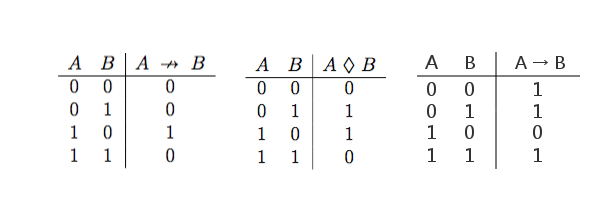

### Aufgabenstellung

1. Zeigen Sie, dass die Operatormenge {$\not\rightarrow$, 1} vollständig ist, wobei 1 eine gültige Formel repräsentiert und  durch folgende Wahrheitstafel definiert wird:
2. Zeigen Sie,dass die Operatormenge{♦,→}vollständigist,wobei $\rightarrow$ der übliche Implikations-Operator ist und ♦ (“Dingsi”) durch folgende Wahrheitstafel definiert wird:

#### Zwischenschritt

Vergleiche die obigen Wahrheitstabellen, um eindeutlich zu erklären.

- Wir wissen, $ A \rightarrow B \equiv \lnot A \lor B $

  d.h. wenn B=0, erhalten wir die Darstellung von $ \lnot A $.  
  Schaue die erste Wahrheitstabelle an, schreiben wir DNF wie $ A \not \rightarrow B \equiv A \land \lnot B $, d.h. wenn A=1, bekommen wir $ \lnot B $. Warum schreibt man DNF? Denn es liegt nur einen Einswert darin, deshalb vereinfachen wir die Aufgabe.

  Während macht man DNF oder KNF in zweite Wahrheitstabelle(Aufgabe 2) nicht gut, denn wir haben sowohl zwei Einswerte als auch zwei Nullswerte. In der Tatsache wählen wir KNF oder DNF aus, um die Wahrheitstafeln der Formel darzustellen, dann können wir von der KNF oder DNF die Beschreibung der Negation bestimmen.

  Falls es das Zeichen Negation gibt, schaffen wir die Aufgabe zu Vollständigkeit locker. Bei der Aufgabe 10b, betrachten wir die Wahrheitstabelle, die eine Negation der ersten(Implikation) Tabelle ist. d.h.

  $ A \not\rightarrow B \equiv \lnot (A \rightarrow B) $, eigentlich genau wie DNF, die obig erwähnt ist.

  Jetzt löschen wir die Aufgabe 1,

  Negation: $ \lnot B \equiv 1 \not \rightarrow B $

  Und: $ A \lor B \equiv \lnot A \rightarrow B \equiv \lnot \lnot (\lnot A \rightarrow B ) \equiv \lnot (\lnot (\lnot A \rightarrow B )) \equiv \lnot (\lnot A \not \rightarrow B) $

- Ich würde die zweite Wahrheitstabelle (Aufgabe 2), die kompliziert ist. Aber wir betrachten auch die Formel von Implikation. Denn es gibt negierte Aussage in der Formel der Implikation, nämlich $ A \rightarrow B \equiv \lnot A \lor B $, damit können wir schnell das Zeichen von Negation bekommen dadurch, dass wir B=0 setzen. Zurzeit liegt es daran, wie man den Nullswert finden.

  Werfe einen Blick auf die zweite Wahrheitstabelle, suche die Nullswerte darin. Also steht dies Nulls in erster und letzter Zeile. Welche Eigenschaften besitzen die Zeilen? d.h. wenn A und B gleichen Wert besitzen, nämlich A ♦ A = 0. Also lösen wir nach der obigen Methode schnell auf.
